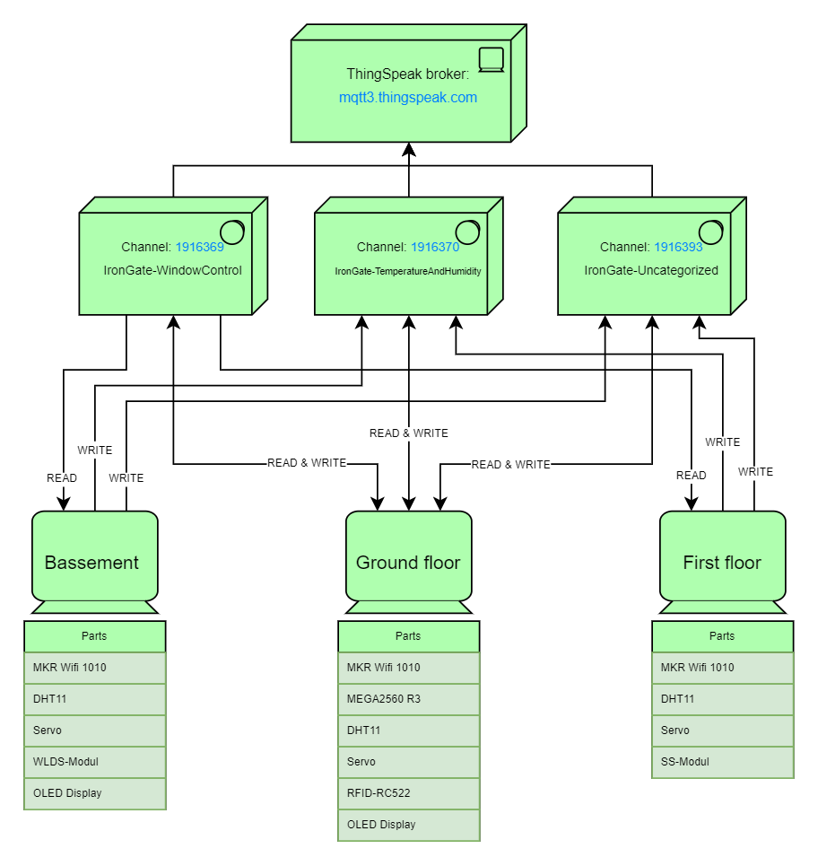
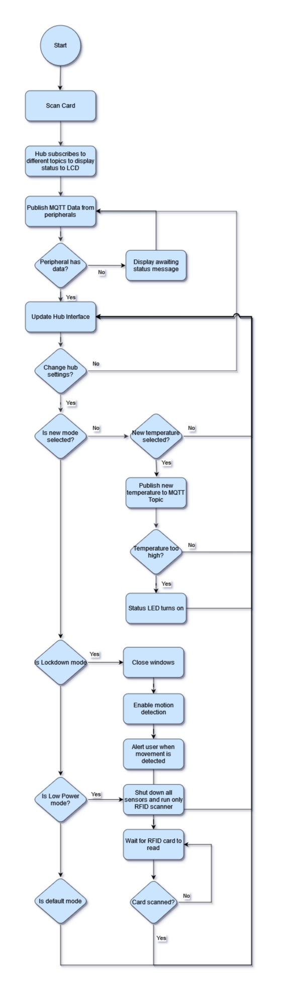
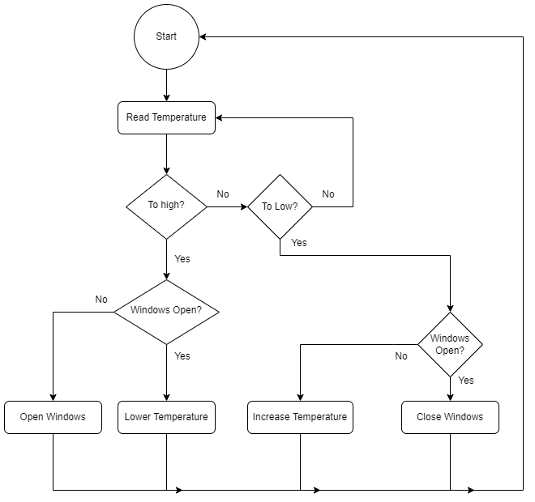
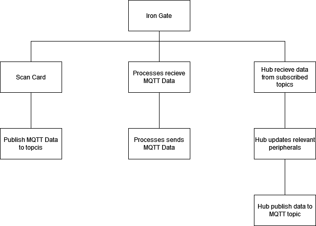
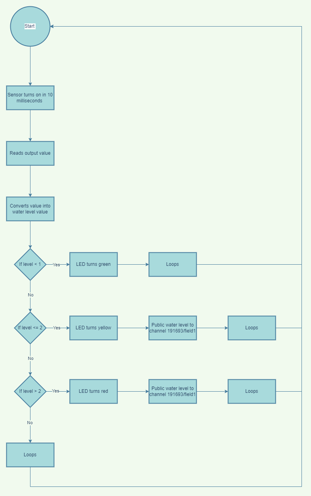

# The IronGate project

The future is now! Every home needs great security, and with great security, comes alot of sensors.

The IronGate Project secures your house with state of the art security tools like, MQTT notification, RFID card readers, Online status of electronics and so much more.

 

## Goals
Find these under [ProjektFormulering.md](ProjektFormulering.md)

## Technical Details
### Libraries
This section contains information about what libraries the different devices uses.

#### First floor device
| Part | Library | Author  | Version |
|------|---------|---------|---------|
| MKR Wifi 1010 | WifiNINA | Arduino | 1.8.13 |
| DHT11 | Adafruit Unified Sensor | Adafruit | 1.1.6 |
| DHT11 | DHT sensor library | Adafruit | 1.4.4 |
| Servo | Adafruit SoftServo | Adafruit | 1.0.2 |
| None | MQTT | Joel Gaehwiler | 2.5.0 |
| None | ArduinoJson | Benoit Blanchon | 6.19.4 |

#### Ground floor device
| Part | Library | Author  | Version |
|------|---------|---------|---------|
| MKR Wifi 1010 | WifiNINA | Arduino | 1.8.13 |
| DHT11 | Adafruit Unified Sensor | Adafruit | 1.1.6 |
| DHT11 | DHT sensor library | Adafruit | 1.4.4 |
| Servo | Adafruit SoftServo | Adafruit | 1.0.2 |
| None | MQTT | Joel Gaehwiler | 2.5.0 |

#### Bassement floor device
| Part | Library | Author  | Version |
|------|---------|---------|---------|
| MKR Wifi 1010 | WifiNINA | Arduino | 1.8.13 |
| DHT11 | Adafruit Unified Sensor | Adafruit | 1.1.6 |
| DHT11 | DHT sensor library | Adafruit | 1.4.4 |
| Servo | Adafruit SoftServo | Adafruit | 1.0.2 |
| OLED | Addafruit SSD1306 | Adafruit | 2.5.6 |
| None | MQTT | Joel Gaehwiler | 2.5.0 |

### Channel descriptions
This section contains descriptions about all the channels the devices uses.

#### 1916369 - IronGate-WindowControl
The *1916369* channel is the IronGate window control channel and is used by the diffrent devices to subscribe and listen to.

The only devices that also has publish permission on this channel is the **Ground floor device**, **First floor device** and the **Client test device**.

#### 1916370 - IronGate-TemperatureAndHumidity
The *1916370* channel is the IronGate temperatures and humidity channel and is used by all devices to publish their temperatures and humidity data to.

The only devices that can subscribe to this channel is the **Ground floor device** and the **Client test device**.

#### 1916393 - IronGate-Uncategorized
The *1916393* channel is the IronGate uncategorized data channel and is used for specific data like the *WLDS-Modul* water level and the *SS-Modul* sound detected data.

The only devices that can subscribe to this channel is the **Ground floor device** and the **Client test device**.

### Channel fields
This section contains information about what fields the diffrent devices is using.

#### 1916369 - IronGate-WindowControl
| Device | Field | Purpose |
|---------|-------|---------|
| Bassement | Field1 | Servo controls |
| Ground floor | Field3 | Servo controls |
| First floor | Field5 | Servo controls |

#### 1916370 - IronGate-TemperatureAndHumidity
| Device | Field | Purpose |
|---------|-------|---------|
| Bassement | Field1 | Temperature data |
| Bassement | Field2 | Humidity data |
| Ground floor | Field4 | Temperature data |
| Ground floor | Field5 | Humidity data |
| First floor | Field7 | Temperature data |
| First floor | Field8 | Humidity data |

#### 1916393 - IronGate-Uncategorized
| Device | Field | Purpose |
|---------|-------|---------|
| Bassement | Field1 | Water level data |
| Ground floor | Field4 | Motion sensor data |
| First floor | Field7 | Sound sensor data |

### Permissions
This section contains information about what permissions the diffrent device have on the ThingSpeak broker.

#### First floor device
| Channel | Publish | Subscribe |
|---------|---------|-----------|
| 1916369 | X | X |
| 1916370 | X | |
| 1916393 | X | |

#### Ground floor device
| Channel | Publish | Subscribe |
|---------|---------|-----------|
| 1916369 | X | X |
| 1916370 | X | X |
| 1916393 | X | X |

#### Bassement floor device
| Channel | Publish | Subscribe |
|---------|---------|-----------|
| 1916369 | | X |
| 1916370 | X | |
| 1916393 | X | |

#### Client test device
This device is only used for test purposes.

| Channel | Publish | Subscribe |
|---------|---------|-----------|
| 1916369 | X | X |
| 1916370 | X | X |
| 1916393 | X | X |

### Access
This section contains information about what credentials the diffrent devices is using.

#### First floor device
- Host = mqtt3.thingspeak.com
- Username = NAU4KRsqEB05FzIpJCUvBy0
- ClientId = NAU4KRsqEB05FzIpJCUvBy0
- Password = lDoIYJHbpSkvHVOXAO+eqa/M

#### Ground  floor device
- Host = mqtt3.thingspeak.com
- Username = DgciLSs4AAUdCy8AAjsoFgE
- ClientId = DgciLSs4AAUdCy8AAjsoFgE
- Password = GYsbytl/X62bjKR9JbYHEsQP

#### Bassement floor device
- Host = mqtt3.thingspeak.com
- Username = CQ0EDQI2GxoiETYQEAAwEhE
- ClientId = CQ0EDQI2GxoiETYQEAAwEhE
- Password = ZZP3jZxHza3XO1XMJ4AFbk65

#### Client test device
This device is only used for test purposes.

- Host = mqtt3.thingspeak.com
- Username = GCcqATMiOBASNBspJzkSMwI
- ClientId = GCcqATMiOBASNBspJzkSMwI
- Password = hSSRXoNF/co86QYUOwJVZ4jd

## Diagrams
### Psysical Architecture

### Flowcharts
This section contains the flowchart of the diffrent devices.

#### First floor device

#### Ground floor device
##### RFID access flowchart

##### Climate control flowchart

##### HIPO flowchart

#### Bassement floor device
##### Water level sensor flowchart

## Use of third party apps and libraries
The diagram, images and flowcharts was created in [Draw.io](https://www.draw.io).

## Responsibles  
|Name|Role|
|----|----|
|Nicklas|Developer|
|Casper|Developer|
|Tobias|Developer|
